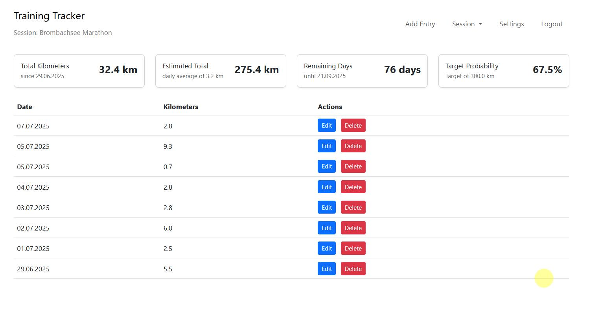
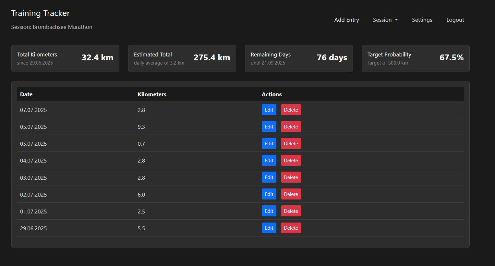

# Marathon Training Tracker

A web application to track your running progress and monitor your marathon training goals.

## Screenshots

### Desktop View

Light Theme:



Dark Theme:



### Mobile View

Light Theme:


Dark Theme:


## Features

- Track daily running distances
- Set training period and target kilometers
- View estimated completion and probability of reaching goals
- Responsive design for desktop and mobile

## Requirements

- PHP 8.1+
- SQLite
- Composer

## Installation

1. Clone the repository:

```bash
git clone https://github.com/BenjaminKobjolke/track-kilometers-for-your-next-marathon.git
cd track-kilometers-for-your-next-marathon
```

2. Install dependencies:

```bash
composer install
```

3. Set up the database:

   ```bash
   php database/migrate.php
   ```

   This will create the SQLite database file at `database/database.sqlite` and set up all required tables.

4. Configure the application:
   Create `config.php` (have a look at config_example.php) in the root directory:

   ```php
   <?php
   return [
       'base_url' => '/track-kilometers-for-your-next-marathon/public',  // Update this for your environment
       'email' => [
           'from_address' => 'your-email@domain.com',  // Email address for password reset emails
           'from_name' => 'Marathon Training Tracker'   // Name shown in emails
       ]
   ];
   ```

   - Set `base_url` to match your deployment path (same as RewriteBase in .htaccess)
   - Update `from_address` to your email address
   - Customize `from_name` if desired

   Note: The `base_url` in config.php and RewriteBase in .htaccess should match your deployment path.

## Usage

1. Start webserver

2. Open your browser and navigate the root URL of the application, e.g. `http://localhost/track-kilometers-for-your-next-marathon`.

## Features

### Run Tracking

- Add new runs with date and distance
- Edit existing runs
- View chronological list of runs

### Goal Setting

- Set start and end dates for your training period
- Define target total kilometers
- View probability of reaching your goal

### Statistics

- See estimated total kilometers by end date
- Monitor remaining days
- Track progress probability

## Development

The project uses:

- Illuminate/Database (Eloquent) for database operations
- Bootstrap 5 for responsive design
- Native JavaScript for frontend functionality

## License

MIT License - see LICENSE file for details
