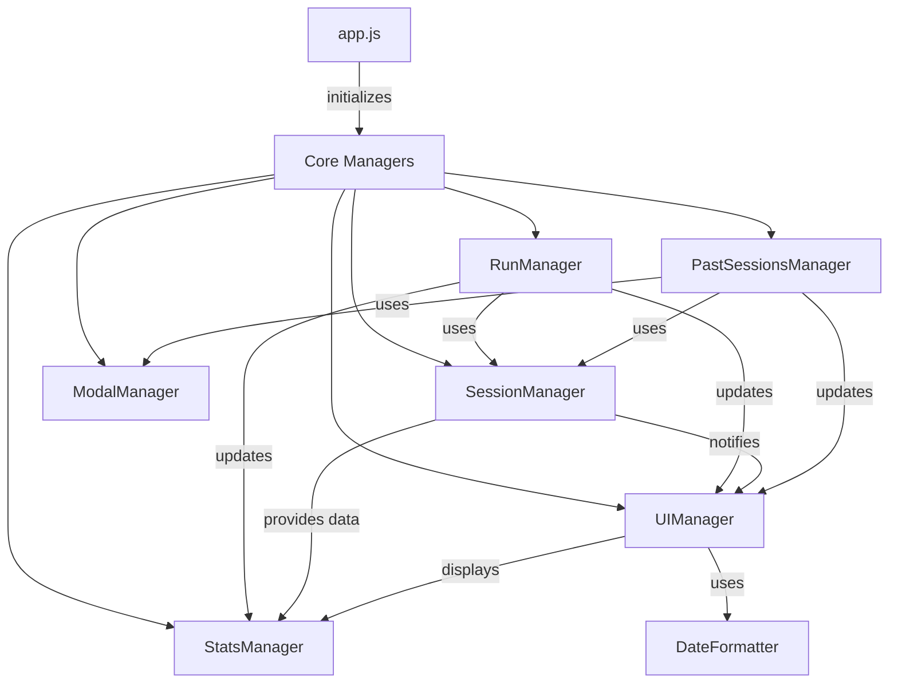

# System Patterns

## Architecture

### Module Organization

- Each module has a single responsibility
- Modules communicate through well-defined interfaces
- Dependencies are injected through constructors
- Event handlers are properly managed and cleaned up

### Component Relationships

## Design Patterns

### Observer Pattern

- UIManager observes changes in data and updates the view
- StatsManager observes changes in runs and updates statistics
- Event listeners observe user actions and trigger appropriate handlers

### Dependency Injection

- Managers receive their dependencies through constructors
- This allows for better testing and modularity
- Prevents tight coupling between components

### Factory Pattern

- Managers are created in app.js
- Each manager is responsible for creating its own sub-components
- Ensures consistent object creation

## UI Patterns

### Responsive Design

- Mobile-first approach
- Breakpoints:
  - 991.98px for tablet/desktop transition
  - 375px for small mobile devices
- Proper spacing and sizing for all screen sizes

### Component Styling

- Consistent class naming convention
- Semantic class names (e.g., 'probability-card' instead of nth-child)
- Proper CSS specificity management
- Dark mode support through data-attributes

### Event Handling

- Event listeners are properly bound and unbound
- Event delegation where appropriate
- Proper cleanup to prevent memory leaks
- Centralized event management in each module

## Data Flow

### State Management

- Session state managed by SessionManager
- UI state managed by UIManager
- Stats state managed by StatsManager
- Modal state managed by ModalManager

### Data Updates

1. User action triggers event
2. Manager processes the action
3. Data is updated through API
4. UI is refreshed with new data
5. Stats are recalculated
6. Event listeners are rebound

## Error Handling

- Each module handles its own errors
- Errors are logged to console
- User-friendly error messages displayed
- Graceful fallbacks for failed operations

## Best Practices

### Code Organization

- Clear file structure
- Consistent naming conventions
- Proper code documentation
- Single responsibility principle

### Performance

- Efficient event handling
- Minimal DOM updates
- Proper cleanup of resources
- Optimized mobile experience

### Accessibility

- Semantic HTML
- Proper ARIA attributes
- Keyboard navigation support
- Screen reader compatibility
